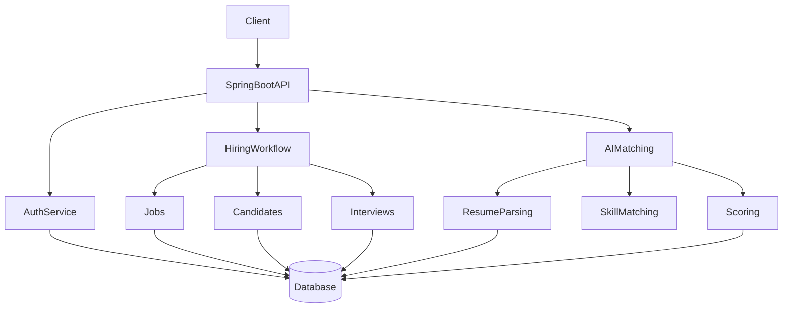
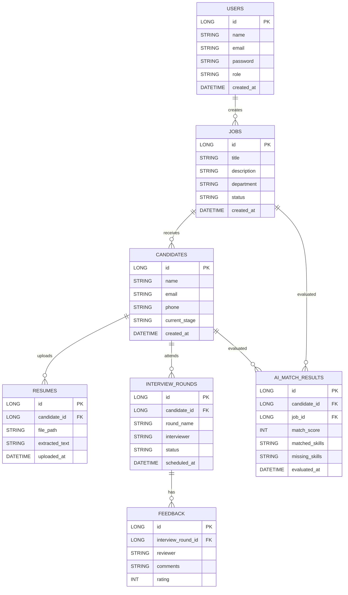

# Hiring-Pipeline-Backend
Production-grade hiring workflow backend built with Java &amp; Spring Boot, featuring AI-assisted resume matching and explainable candidate scoring.

# Hiring Pipeline Backend (AI-Enhanced)

A **production-grade backend system** built using **Java and Spring Boot** to manage end-to-end hiring workflows, enhanced with an **AI-assisted resume matching layer** to demonstrate adaptability to emerging technologies.

This project simulates a **real-world internal Applicant Tracking System (ATS)** used by companies to manage jobs, candidates, interview stages, and shortlisting — with a strong focus on **backend engineering principles** rather than UI-heavy implementations.

---

## 🚀 Why This Project?

Many ATS or resume tools focus mainly on UI or black-box AI scoring.  
This project is intentionally **backend-first** and focuses on:

- Clean REST API design
- Secure authentication & authorization
- Business workflow modeling
- Database design & data consistency
- Explainable AI integration

The goal is to demonstrate **real-world backend engineering skills** expected from an **SDE-1 / Backend Engineer**.

---

## 🧩 Core Features

### 1️⃣ Hiring Workflow Management (Primary)
- Create and manage job postings
- Add and manage candidates
- Move candidates across hiring stages  
  `APPLIED → SCREENING → INTERVIEW → OFFER → HIRED`
- Track interview rounds and interviewer feedback
- Role-based access control (HR / Interviewer)

### 2️⃣ Resume Intelligence (AI-Assisted)
- Upload and parse resumes (PDF)
- Extract relevant skills from resume content
- Match resumes against job descriptions
- Generate **explainable matching results**:
  - Matched skills
  - Missing skills
  - Final match score

> AI is used as an **assistive layer**, not as a black-box dependency.

---

## 🏗️ High-Level Architecture

## 🏗️ DB Schema

## 🏗️ Sequence Diagram
```mermaid
sequenceDiagram
actor Recruiter
participant Client
participant API as SpringBootAPI
participant ResumeSvc as ResumeService
participant AISvc as AIMatchingService
participant DB as Database

Recruiter ->> Client: Upload resume for candidate
Client ->> API: POST /resumes/upload
API ->> ResumeSvc: Validate & store resume
ResumeSvc ->> DB: Save resume metadata & text
ResumeSvc ->> AISvc: Trigger resume-job matching
AISvc ->> DB: Fetch job requirements
AISvc ->> AISvc: Extract skills & compute score
AISvc ->> DB: Save match results
AISvc -->> API: Return match score & insights
API -->> Client: Response with explainable score

